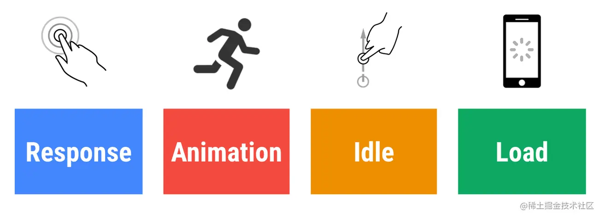
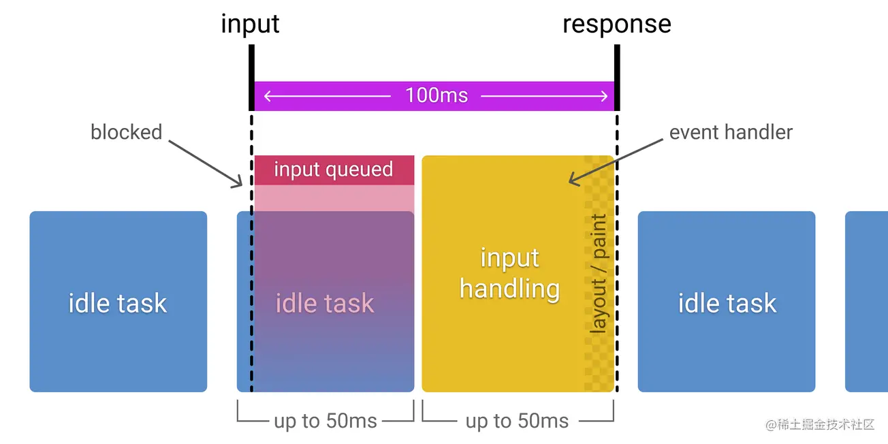

### RAIL性能模型

- Response:输入延迟时间（从点按到绘制）小于100毫秒
- Animation:每个帧的工作（从JS到绘制）完成时间小于16毫秒
- Idle:主线程JS工作分成不大于50毫秒的块
- Load:页面可以再1000毫秒内准备就绪

| 延迟时间        | 用户感知                   |
| --------------- | -------------------------- |
| 0-16ms          | 很流畅                     |
| 0-100ms         | 基本流畅                   |
| 100-1000ms      | 感觉到网站上有一些加载任务 |
| 1000ms or more  | 失去耐心了                 |
| 10000ms or more | 直接离开，不会再访问了     |

#### R(Response)响应

##### 目标

- 事件处理最好在50ms内完成，用户的输入到响应的时间不超过100ms

##### 优化方案

- 事件处理函数在50ms内完成，考虑到idle task的情况，事件会排队，等待时间大概在50ms。适用于click，toggle，starting animations等，不适用于drag和scroll。
- 复杂的js计算尽可能放在后台，如web worker，避免对用户输入造成阻塞
- 超过50ms的响应，一定要提供反馈，比如倒计时，进度百分比等。

> idle task：除了要处理输入事件，浏览器还有其它任务要做，这些任务会占用部分时间，一般情况会花费50ms的时间，输入事件的响应则排在其后。

#### A(Animation)动画

##### 目标

- 产生每一帧的时间不要超过10ms，为了保证浏览器60帧，每一帧的时间在16ms左右，但浏览器需要用6ms来渲染每一帧。

##### 优化方案

- 在一些高压点上，比如动画，不要去挑战cpu，尽可能地少做事，如：取offset，设置style等操作。尽可能地保证60帧的体验。

#### I(Idle)空闲

##### 目标

- 最大化空闲时间，以增大50ms内响应用户输入的几率

##### 优化方案

- 用空闲时间来完成一些延后的工作，如先加载页面可见的部分，然后利用空闲时间加载剩余部分，此处可以使用 [requestIdleCallback API](https://link.juejin.cn/?target=https%3A%2F%2Fdeveloper.mozilla.org%2Fen-US%2Fdocs%2FWeb%2FAPI%2FWindow%2FrequestIdleCallback)

#### L(Load)加载

##### 目标

- 首次加载应在小于5S时间内加载完成，并可以进行用户交互，对于后续加载，则是建议在2S内完成

##### 优化方案

- [禁用渲染阻塞的资源，延后加载](https://link.juejin.cn/?target=https%3A%2F%2Fweb.dev%2Frender-blocking-resources%2F)
- 可以采用 [lazy load](https://link.juejin.cn/?target=https%3A%2F%2Fweb.dev%2Fnative-lazy-loading%2F)，[code-splitting](https://link.juejin.cn/?target=https%3A%2F%2Fweb.dev%2Freduce-javascript-payloads-with-code-splitting%2F) 等 [其他优化](https://link.juejin.cn/?target=https%3A%2F%2Fweb.dev%2Ffast%2F) 手段，让第一次加载的资源更少