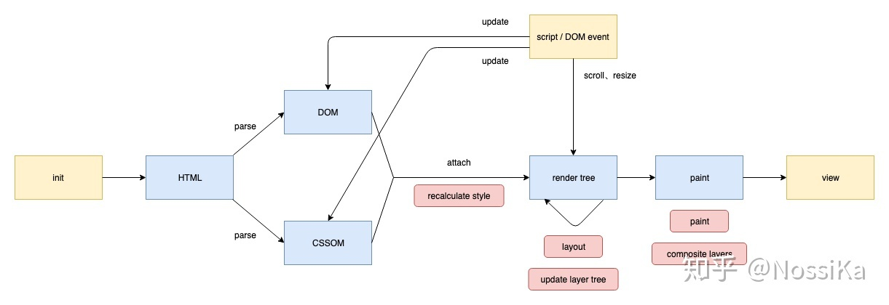

### Chrome DevTools

#### Lighthouse

关于如何得到这个评估得分，Lighthouse首先会获取关于评估指标的原始性能数据，然后根据指标权重进行加权计算，最后以其数据库中的大量的评估结果对数正态分布的映射并计算最终得分

[https://googlechrome.github.io/lighthouse/scorecalc/#FCP=1039&TTI=3074&SI=3422&TBT=31&LCP=3317&CLS=0&FMP=2061&device=desktop&version=9.5.0](https://googlechrome.github.io/lighthouse/scorecalc/#FCP=1039&TTI=3074&SI=3422&TBT=31&LCP=3317&CLS=0&FMP=2061&device=desktop&version=9.5.0)

#### Performance面板

1. 控制面板（Controls）：开启记录，停止记录，配置记录期间需要记录的内容。
2. 概括（Overview）:FPS,CPU,NET
3. 火焰图（Flame Chart）: 可视化 CPU 堆栈(stack)信息记录,例如：Network，Frames, Interactions, Main等
4. 详细信息（Detail）: 当有具体事件被选择时，该面板展示这个事件的更多详细信息。如果没有事件被选择，该面板展示当前所选时间段的一些信息。

#### 诊断

- JS

  会触发大量视觉变化的计算会降低应用性能，下面是一些常见 JavaScript 问题

  1. 大开销输入处理程序影响响应或动画

     让浏览器尽可能晚地处理触摸和滚动，或者绑定侦听，使用被动事件监听器

  2. 时机不当的 JavaScript 影响响应、动画、加载

     使用 `requestAnimationFrame`、使 DOM 操作遍布各个帧、使用网络工作线程

  3. 长时间运行的 JavaScript 影响响应

     将纯粹的计算工作转移到web worker中。如果需要 DOM 访问权限，配合使用`requestAnimationFrame`

- 样式

  

  渲染过程中，layout可能被跳过，比如对样式的修改不影响layout时，则只需repaint而不需reflow。

  下面是一些常见的CSS问题

    1. 大开销样式计算影响响应或动画

       任何会更改元素几何形状的 CSS 属性，如宽度、高度或位置；浏览器必须检查所有其他元素并重做布局。避免会触发重排的CSS属性

    2. 复杂的选择器影响响应或动画

       嵌套选择器强制浏览器了解与所有其他元素有关的全部内容，包括父级和子级。尽量在CSS中引用只有一个类的元素

- 回流（重排）

  如果在帧完成前从 DOM 请求返回几何值，将发现会出现“强制同步布局”，在频繁地重复或针对较大的 DOM 树执行操作时这会成为性能的大瓶颈。performance面板可以确定页面何时会导致强制同步布局。 这些 **Layout** 事件使用红色竖线标记.

  

- 重绘

  绘制是填充像素的过程。这经常是渲染流程开销最大的部分

  下面是一些常见的绘制问题

  1. 层数激增影响动画

  　　使用 translateZ(0) 过度提升过多的元素会严重影响动画性能，要谨慎提升到层，并且仅在了解这样会有切实改进时才提升到层

**查看动画案例**

#### FPS面板和性能监视器

##### FPS面板

打开devtools后，command+shift+p打开搜索，输入fps控制fps实施面板的开关

##### 性能监视器

在devtools更多工具中打开，可用于实施检测各项指标的动态