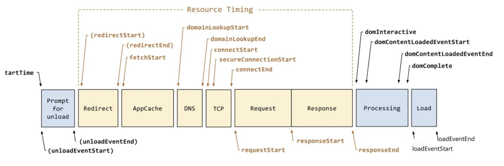
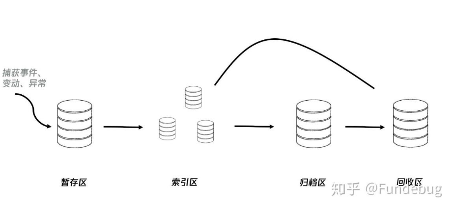
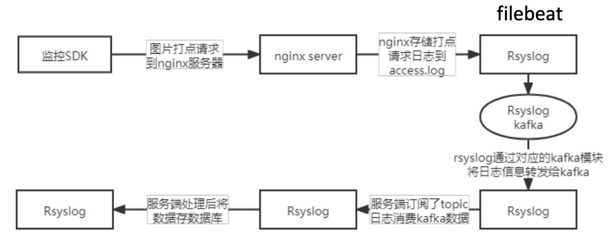

### Web性能监控

#### 埋点

- **手动埋点**

  1. 命令埋点:在前端代码中需要监控的地方插入监控逻辑。如在页面加载时或按钮点击时调用埋点SDK函数进行数据上报

  2. 声明式埋点:声明式埋点的思路是将埋点代码和具体的交互和业务逻辑解耦，开发者只用关心需要埋点的控件，并且为这些控件声

     明需要的埋点数据即可(比如在dom元素上增添埋点信息(`<button data-stat=“{key:‘111’, act: ‘click’}”>埋点</button>` )，遍 历dom树，找到`[data-stat]`元素的节点，绑定click事件，将`[data-stat]`上的信息发送给服务器)

- **可视化埋点**

  提供一个可视化交互的页面，输入为业务代码，通过这个可视化系统，可以在业务代码中自定义的增加埋点事件等等 国外比较早做可视化的是 Mixpanel，国内较早支持可视化埋点的有TalkingData、诸葛 IO，2017年腾讯的 MTA 也宣布支持可视化埋 点
   可视化埋点中多数基于Xpath的方案

- **无埋点**

  前端自动采集全部事件，上报埋点数据，由后端来过滤和计算出有用的数据，采用无埋点技术的有主流GrowingIO、神策。

  手段:统一标识控件、统一拦截用户行为，主要还是点击事件
  优势:无埋点效率高，避免多团队沟通，快速且可涉及范围广，不会受系统升级改版及复杂的交互影响
  劣势:不适合重业务场景

#### 数据采集



```####javascript
//获取除paint外的性能信息
const getExceptPaintInfo = () => {
  const resultObj = {};
  resultObj.nativePerformance = createResultItem(window.performance, 'performance的原生对象');
  const { timeOrigin = 0, navigation = {} } = window.performance;
  resultObj.monitorStartTimePoint = createResultItem(timeOrigin, '性能监测开始的时间');
  const { type = '', redirectCount = 0 } = navigation;
  resultObj.redirectCount = createResultItem(redirectCount, '页面被重定向的次数');
  resultObj.type = createResultItem(type, typeMap[type]);
  const newNavigation = window.performance.getEntriesByType('navigation')[0];
  const {
    nextHopProtocol = '', name = '',
    redirectStart = 0, redirectEnd = 0,
    domainLookupStart = 0, domainLookupEnd = 0,
    fetchStart = 0,
    connectStart = 0, connectEnd = 0, secureConnectionStart = 0,
    requestStart = 0, responseStart = 0, responseEnd = 0,
    unloadEventStart = 0, unloadEventEnd = 0,
    domInteractive = 0, domComplete = 0,
    domContentLoadedEventStart = 0, domContentLoadedEventEnd = 0,
    serverTiming = [],
    loadEventStart = 0, loadEventEnd = 0,

    workerStart = 0, // workerServie开始分配工作的时间
    transferSize = 0, // 表示所取出资源的大小(包含响应头和响应体，若是缓存或跨域，则为0)
    encodedBodySize = 0, // 表示所取出资源编码时的大小(只包含响应体)
    decodedBodySize = 0, // 表示所取出资源解码后的大小(只包含响应体)
  } = newNavigation;
  resultObj.nextHopProtocol = createResultItem(nextHopProtocol, '当前请求使用协议');
  resultObj.address = createResultItem(name, '当前请求使地址');
  resultObj.workerStartTime = createResultItem(workerStart, 'workerServie开始分配工作的时间');
  resultObj.transferSize = createResultItem(transferSize, '表示所取出资源的大小(包含响应头和响应体，若是缓存或跨域，则为0)');
  resultObj.encodedBodySize = createResultItem(encodedBodySize, '表示所取出资源编码时的大小(只包含响应体)');
  resultObj.decodedBodySize = createResultItem(decodedBodySize, '表示所取出资源解码后的大小(只包含响应体)');
  resultObj.redirectTime = createResultItem(redirectEnd - redirectStart, '重定向花费时间');
  resultObj.dnsTime = createResultItem(domainLookupEnd - domainLookupStart, 'dns解析查询花费时间');
  resultObj.TTFBByReal = createResultItem(responseStart - domainLookupStart, '真实的TTFB时间(包含域名解析、tcp链接、请求发起到响应)');
  resultObj.TTFBByNetwork = createResultItem(responseStart - requestStart, 'network中请求的Wait(TTFB)时间(只包含域请求发起到响应)');
  resultObj.appcacheTime = createResultItem(domainLookupStart - fetchStart, '应用读取缓存花费时间');
  resultObj.unloadTime = createResultItem(unloadEventEnd - unloadEventStart, '当前页面/路由组件卸载花费时间');
  resultObj.tcpTime = createResultItem(connectEnd - connectStart, 'tcp链接花费时间');
  resultObj.secureTcpTime = createResultItem(secureConnectionStart ? connectEnd - secureConnectionStart : 0, 'https安全链接(ssl)握手花费时间');
  resultObj.resposeTime = createResultItem(responseEnd - responseStart, '请求成功后下载响应数据花费时间');
  resultObj.analysisDomTime = createResultItem(domComplete - domInteractive, '单页面客户端渲染下，为解析模板dom树所花费时间；非单页面或单页面服务端渲染下，为解析实际dom树所花费时间');
  resultObj.domReadyTime = createResultItem(domContentLoadedEventEnd - fetchStart, '单页面客户端渲染下，为生成模板dom树所花费时间；非单页面或单页面服务端渲染下，为生成实际dom树所花费时间');
  resultObj.domContentLoadEventTime = createResultItem(domContentLoadedEventEnd - domContentLoadedEventStart, 'onDomContentLoad事件执行花费的时间');
  resultObj.serverTiming = createResultItem(serverTiming, '一个请求内，服务器在响应过程中，各步骤耗时指标。由后端设置于reponse header中，受跨域限制');
  resultObj.LoadEventTime = createResultItem(loadEventEnd - loadEventStart, 'onLoad事件执行花费的时间');
  resultObj.pageLoadTime = createResultItem(loadEventEnd - fetchStart, '单页面客户端渲染下，模板页面加载(用户等待)所花费时间；非单页面或单页面服务端渲染下，为实际页面加载(用户等待)花费时间');
  resultObj.startRender = createResultItem(domContentLoadedEventStart - domainLookupStart, 'TTFB(发起请求到服务器返回数据的时间) + TTDD(从服务器加载HTML文档的时间) + TTHE(HTML文档头部解析完成所需要的时间)');
  return resultObj;
}
//获取paint性能信息
const getPaintInfo = () => {
  const resultObj = {};
  const newNavigation = window.performance.getEntriesByType('navigation')[0];
  const { fetchStart = 0, } = newNavigation;
  const firstPaint = window.performance.getEntriesByType('paint')[0];
  const { startTime: firstPaintTime = 0 } = firstPaint;
  resultObj.firstPaintTime = createResultItem(firstPaintTime - fetchStart, '首次渲染时间(第⼀个非网页背景像素渲染)');
  const firstContentPaint = window.performance.getEntriesByType('paint')[1];
  const { startTime: firstContentPaintTime = 0 } = firstContentPaint;
  resultObj.firstContentPaintTime = createResultItem(firstContentPaintTime - fetchStart, '首次内容渲染时间(第一个 ⽂本、图像、背景图片或非白色 canvas/SVG 内容渲染)');

  return resultObj;
}

//监测性能核心代码
const performanceCore = (res = () => {}, everyPollingTime = 100, pollingTime = 1000, type = '') => {
  const currTime = window.performance.now();
  const polling = setInterval(() => {
    const everyTime = window.performance.now();
    const paintEntryArr = window.performance.getEntriesByType('paint');
    if(paintEntryArr.length > 0){
      clearInterval(polling);
      const exceptPaintInfo = getExceptPaintInfo();
      const paintInfo = getPaintInfo();
      const includePaintInfoObj = Object.assign({}, exceptPaintInfo, paintInfo, { msg:'包含paint相关信息!', type })
      res(includePaintInfoObj);
    } else if(everyTime - currTime > pollingTime){
      clearInterval(polling);
      const exceptPaintInfo = getExceptPaintInfo();
      const expectPaintInfoObj = Object.assign({}, exceptPaintInfo, { msg:'未包含paint相关信息(总轮询时间太短或不支持paint类型entry)!', type })
      res(expectPaintInfoObj);
    }
  }, everyPollingTime);
}

```

#### 日志上报方式

关于[sendBeacon](https://developer.mozilla.org/zh-CN/docs/Web/API/Navigator/sendBeacon)

| 方式类型/对比参数 |            接口请求            |                      图片打点                       |                     sendBeacon                      |
| :---------------: | :----------------------------: | :-------------------------------------------------: | :-------------------------------------------------: |
|   资源占用大小    |   一般POST传输，开销相对较大   |                        很小                         |                        较小                         |
|   是否阻塞页面    |    异步不阻塞页面，同步阻塞    |                       不阻塞                        |                       不阻塞                        |
|   传输数据大小    | 使用POST传输量很大，无特殊限制 |       由于使用get,传输量比较小，一般为 2~8kb        |                较小，chrome一般64kb                 |
|   是否支持跨域    |  默认不支持跨域，需要特殊配置  |                    天然支持跨域                     |                      支持跨域                       |
|      安全性       |              一般              |           由于请求的是静态资源，相对安全            |                        一般                         |
|     实施难度      |    相对简单，和开发业务类似    | 相对复杂，需要先记录日志，再分析     日志，提取数据 | 取决于采取的是打点日志方式还是直     接解析数据方式 |

**为什么主流方案用GIF上报数据**

- 一般来讲，打点域名都不是当前域名，GET/POST/HEAD会构成跨域
- 如果用请求js/css/ttf等普通文件方式，由于创建资源节点后只有将对象注入到浏览器DOM树后，浏览器才会实际发送资源请求，反复操作DOM不仅会引发性能问题，而且载入js/css资源还会阻塞页面渲染，影响用户体验。
- 构造图片打点不仅不用插入DOM，只要在js中new出Image对象就能发起请求，而且还没有阻塞问题，在没有js的浏览器环境中也能通过img标签正常打点。
- 在所有图片中体积最小，相较BMP/PNG，可以节约41%/35%的网络资源

#### 存储和查询



IndexedDB容量大、异步、分库且可以按索引进行查询，适合作为日志本地存储的 暂存区和索引区。 当一个事件、变动、异常被捕获之后，形成一条初始日志，被立即放入暂存区， 之后主程序就结束了收集过程，后续的事只在webworker中发生。在一个webworker 中，一个循环任务不断从暂存区中取出日志，对日志进行分类，将分类结果存储到 索引区中，最终将会上报到服务端的日志记录转存到归档区。而当一条日志在归档区 中存在的时间超过一定天数之后，它被转存到回收区。



