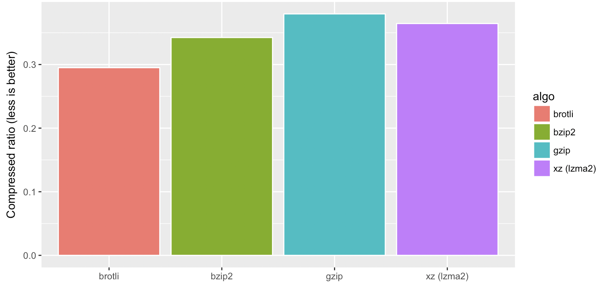
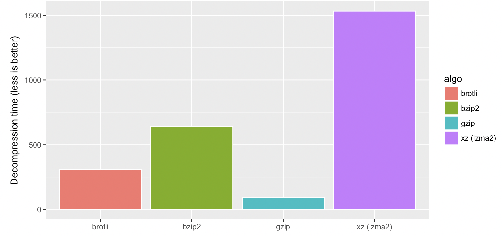
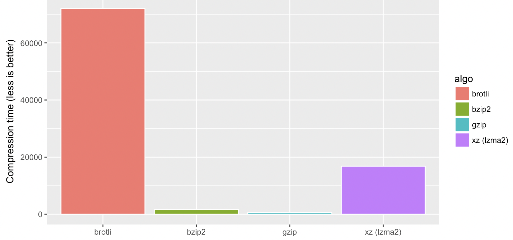

### 优化方案

#### 影响性能的关键因子

- 延迟(RTT)
- 带宽
- 静态资源大小
- TCP/SSL握手时间
- DNS解析时间

#### 方法

##### **CDN**

##### **Cache**

强制缓存（Expires , Cache-Control）和协商缓存（Last-modified , Etag）

- 通过Cache-Control HTTP标头合理控制缓存
- 使用Hash Tag
- Etag也是有性能消耗的

##### **优化带宽使用**

- 延迟加载资源：对静态资源和接口都可以采取此策略，原生Img和Iframe懒加载或使用第三方插件

- 提前加载资源：

  - Preload：表示一定会用到的资源，会提升资源获取的优先级

    `<link rel="preload"   href="https://at.alicdn.com/t/font_zck90zmlh7hf47vi.woff" as="font">`

  - Prefetch：表示可能会用到的资源，空闲时会加载

    `<link rel="prefetch"  href="https://at.alicdn.com/t/font_zck90zmlh7hf47vi.woff" as="font">`

  preload 和 prefetch 混用的话，并不会复用资源，而是会重复加载。

##### **优化资源文件大小**

- 数据压缩优化：

  - **Broti**:Google开源的专门针对http传输压缩的，使用一个预定义的120千字节字典。该字典包含超过13000个常用单词、短语和其他子字符串，通过变种的 LZ77 算法、Huffman 编码以及二阶文本建模等方式进行数据压缩。

    下面三图分别是**Broti,bzip2,gzip,lzma2**四种压缩算法的压缩率，解压时间和压缩时间对比图

  

    
    
    
  

  - **HTTP2.0头文件压缩**：一般而言，消息主体会经过压缩算法进行压缩传输，但状态行和头部是以纯文本的方式进行传输的，有效的替代了cookie-less domain技术。
  - **Minification**:牺牲代码的可读性，减小文件体积。UglifyJS , terser-webpack-plugin

- Tree Shaking:识别并移除dead code,依赖于ES2015的**import**和**export**语句

- Domain Sharding(域名分片)：每个域的活动连接数被浏览器所限制，域名分散便于同时下载更多资源，但DNS相关开销增大。**HTTP2.0中已经取消了这种限制**。

- DNS Prefetch

##### **减少TCP创建开销**

- 减少页面重定向
- 使用CDN

##### HTTP2

http1.1和2.0 最大的区别是二进制框架层和多路复用。与 http1.1把所有请求和响应作为纯文本不同，http2 使用二进制框架层把所有消息封装成二进制，且仍然保持http语法

##### Private prefetch proxy（私有预取代理）

Google新的数据预取方案，适用于跨站数据预取，在Cookies和缓存上做了安全限制

https://blog.csdn.net/qiwoo_weekly/article/details/124811548